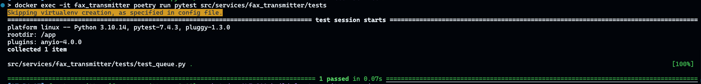
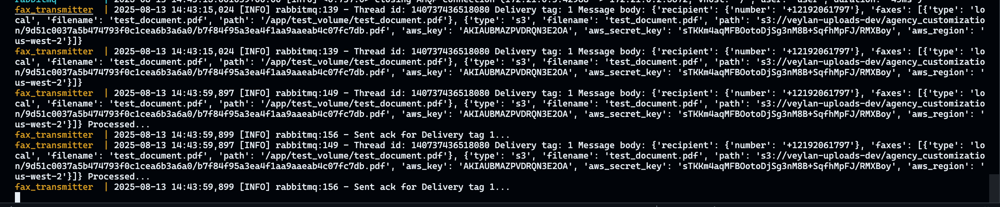
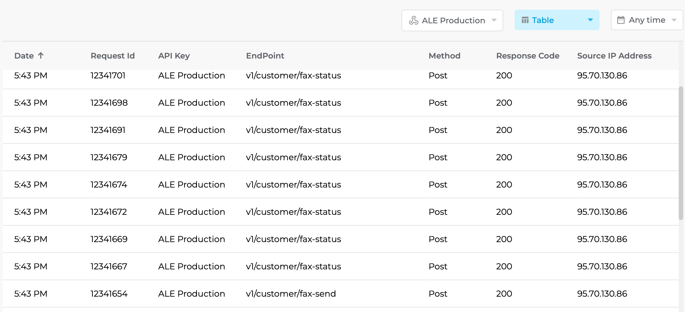

# fax-transmitter
A general fax transmitter that can use various services to send faxes

# Environment variables

The following instructions are for running the service standalone for testing and fax verification

Copy `.env.example` file to `.env` file, Keep the EVs as-is, apart from the following.

`FAX_PROVIDER="ifax"` - This is where you provide the name of the fax provider, currently, only `ifax` is supported.

If you have selected `ifax` as the fax provider then, you have to fill in the following EV as well.

`IFAX_API_KEY=`

# Config.json

Unlike email-transmitter which uses templates, fax-transmitter uses default values configured in `src/config.json`. The service uses a simple event-based configuration:

```json
{
  "events": {
    "DEFAULT": {
      "subject": "Fax Document"
    }
  },
  "configurations": [
    {
      "provider": "ifax"
    }
  ]
}
```

The `DEFAULT` event provides fallback values (like subject) that will be used when not specified in the fax message. The actual fax content comes from document files specified in the message payload, not from predefined templates.

# Docker & Docker Compose

A `docker-compose.yml` file is available in the code just for testing this service against rabbitmq. 
In practice, only the docker image of the service will be built & used

### Run services
- `docker-compose build --no-cache` - this will build the image from ground up 
using the latest `ecorrouge/rococo-service-host` base image.

- `docker-compose up -d` - this will run the `rabbitmq` & `fax-transmitter` services

## Send test message to RabbitMQ
The `tests/test_queue.py` includes a simple test that will send a test fax message to RabbitMQ

- To send a test fax message to rabbitmq, please execute the following command
```shell
docker exec -it fax_transmitter poetry run pytest tests/
```

If the message is delivered successfully to rabbitmq, the test will pass and you will see the following output.


The above message from RabbitMQ will then be picked up by the `fax_processor` to send the actual fax. 
- Run the following command to see the logs of the `fax-transmitter` and verify that it received the message, 
processed it, and sent a fax using `ifax` provider

```shell
docker compose logs fax_transmitter
```
- You should see the following output


- You can also check the iFax API activity logs to verify the fax requests were made successfully


## Message Format

The fax message format supports both local files and S3-stored documents:

```json
{
  "recipient": {
    "number": "Recipient Number (required)",
    "name": "Recipient Name (optional)"
  },
  "subject": "Custom Subject (optional)",
  "message": "Custom message (optional)",
  "fax_quality": "Low|Standard|HD (optional)",
  "send_at": "scheduled send time (optional)",
  "faxes": [
    {
      "type": "local",
      "filename": "document.pdf",
      "path": "/path/to/document.pdf"
    },
    {
      "type": "s3",
      "filename": "document.pdf", 
      "path": "s3://bucket-name/path/to/document.pdf",
      "aws_key": "AWS_ACCESS_KEY",
      "aws_secret_key": "AWS_SECRET_ACCESS_KEY",
      "aws_region": "us-east-1"
    }
  ]
}
